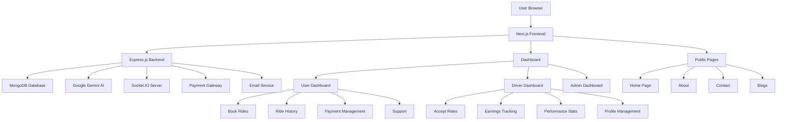

# RideX - Smart Ride-Sharing Platform (Frontend)

RideX is a modern, AI-powered ride-sharing platform that connects passengers with drivers in real-time. This repository contains the frontend implementation built with Next.js, React, and Tailwind CSS.


<div align="center">
  
  
  
  
</div>

---

## 🌐 Live Demo

- **Live Site**: [RideX](https://ridex-ride-sharing.vercel.app)
- **Frontend Repository**: [GitHub - RideX Frontend](https://github.com/yourusername/ridex-frontend)
- **Backend Repository**: [GitHub - RideX Backend](https://github.com/yourusername/ridex-backend)
---
## 📄 User Credentials
- **Email**: ashik03@email.com
- **Password**: 123456
## 📄 Rider Credentials
- **Email**: omarfaruk.dev@gmail.com
- **Password**: 123456
## 📄 Admin Credentials
- **Email**: rubelhosen1310@gmail.com
- **Password**: 4563210

note: RideX is KYC integrated. only verified users can use the platform.
---

## 🚀 Features

### 🚗 Core Ride-Sharing Features
- **Real-time Ride Booking**: Instantly book rides with live driver tracking
- **Multiple Vehicle Options**: Choose from bikes, cars, and CNG vehicles
- **Live Tracking**: Real-time location tracking for both passengers and drivers
- **Secure Payments**: Integrated payment system with multiple payment options
- **Ride History**: Comprehensive ride history with detailed information

### 🤖 AI Integration
- **AI-Powered Chatbot**: Intelligent virtual assistant powered by Google Gemini AI for instant customer support
- **AI Content Generation**: Automated blog content creation using Google Gemini AI for marketing and informational content

### 📱 Modern UI/UX
- **Responsive Design**: Fully responsive interface that works on mobile, tablet, and desktop
- **Dashboard System**: Separate dashboards for users and drivers with role-based access
- **Real-time Notifications**: Live updates and notifications via WebSocket
- **Interactive Maps**: Integrated Leaflet maps for location services

## 🏗️ Architecture



## 🗺️ Routing Structure

### Public Routes
```
/                    # Home page
/about               # About us page
/contact             # Contact page
/blogs               # Blog listing page
/signin              # User sign in
/register            # User registration
/forgot-password     # Password reset
/reset-password      # Password reset form
/become-rider        # Rider registration
/offers              # Special offers page
/privacy-policy      # Privacy policy page
```

### User Dashboard Routes
```
/dashboard/user                      # User dashboard home
/dashboard/user/book-a-ride          # Ride booking interface
/dashboard/user/ongoing-ride         # Active ride tracking
/dashboard/user/ride-history         # Ride history and past trips
/dashboard/user/payment              # Payment management
/dashboard/user/support              # Customer support and chat
```

### Driver Dashboard Routes
```
/dashboard/rider                     # Driver dashboard home
/dashboard/rider/available-rides     # Available ride requests
/dashboard/rider/ongoing-ride        # Active ride management
/dashboard/rider/ride-history        # Ride history and earnings
/dashboard/rider/earnings            # Earnings and payment history
/dashboard/rider/performance-stats   # Performance analytics
/dashboard/rider/profile-vehicle-info # Profile and vehicle management
/dashboard/rider/support             # Driver support
```

### Admin Dashboard Routes
```
/dashboard/admin                     # Admin dashboard home
/dashboard/admin/analytics           # System analytics and reports
/dashboard/admin/users               # User management
/dashboard/admin/drivers             # Driver management
/dashboard/admin/rides               # Ride management
/dashboard/admin/payments            # Payment oversight
/dashboard/admin/blogs               # Content management
```

## 🤖 AI Features

### AI Chatbot
The integrated chatbot uses Google Gemini AI to provide instant customer support:
- Available on all pages via floating chat button
- Answers questions about booking rides, vehicle types, payments, and services
- Provides 24/7 support without human intervention
- Built with React and communicates with backend API

### AI Content Generation
The blog system uses Google Gemini AI to automatically generate content:
- Creates engaging blog posts about ride-sharing topics
- Generates content specifically tailored for Bangladesh's transportation system
- Automatically saves generated content to MongoDB database
- Provides fallback mechanisms for API quota limits

## 🛠️ Tech Stack

### Frontend
- **Next.js 15** - React framework for production
- **React 19** - UI library
- **Tailwind CSS** - Utility-first CSS framework
- **Socket.IO Client** - Real-time communication
- **Leaflet Maps** - Interactive mapping
- **Lucide React** - Icon library
- **Chart.js** - Data visualization
- **GSAP** - Animation library

### Backend (See separate backend README)
- **Node.js** - JavaScript runtime
- **Express.js** - Web framework
- **MongoDB** - NoSQL database
- **Socket.IO** - Real-time communication
- **Google Gemini AI** - Artificial intelligence
- **Nodemailer** - Email service

## 📦 Installation

1. Clone the repository:
```bash
git clone <repository-url>
cd RideX-Frontend
```

2. Install dependencies:
```bash
npm install
```

3. Create a `.env.local` file with the following variables:
```env
NEXT_PUBLIC_SERVER_BASE_URL=http://localhost:5000
```

4. Run the development server:
```bash
npm run dev
```

5. Open [http://localhost:3000](http://localhost:3000) in your browser

## 🚀 Deployment

### Vercel (Recommended)
1. Push your code to a GitHub repository
2. Connect your repository to Vercel
3. Set the environment variables in Vercel dashboard
4. Deploy!

### Manual Deployment
```bash
npm run build
npm start
```

## 📁 Project Structure

```
src/
├── app/                 # Next.js app directory
│   ├── dashboard/       # Dashboard layouts and pages
│   ├── public/          # Public pages
│   └── ...              # Other routes
├── components/          # Reusable UI components
│   ├── Shared/          # Shared components
│   └── ui/              # UI primitives
├── lib/                 # Utility functions
├── utils/               # Helper functions
└── hooks/               # Custom React hooks
```

## 🤝 Contributing

1. Fork the repository
2. Create your feature branch (`git checkout -b feature/AmazingFeature`)
3. Commit your changes (`git commit -m 'Add some AmazingFeature'`)
4. Push to the branch (`git push origin feature/AmazingFeature`)
5. Open a Pull Request

